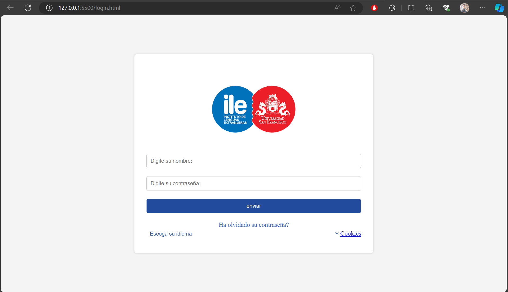
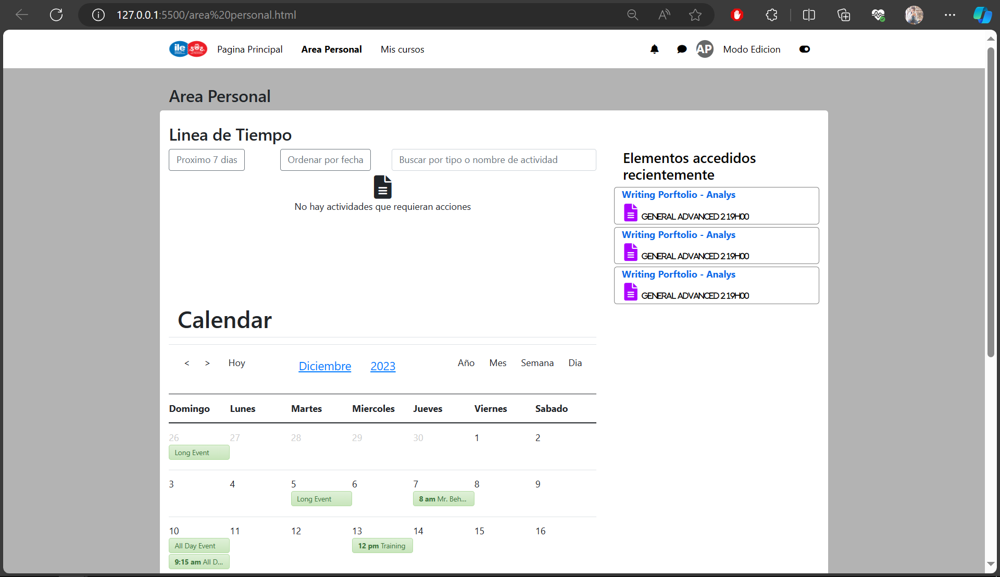
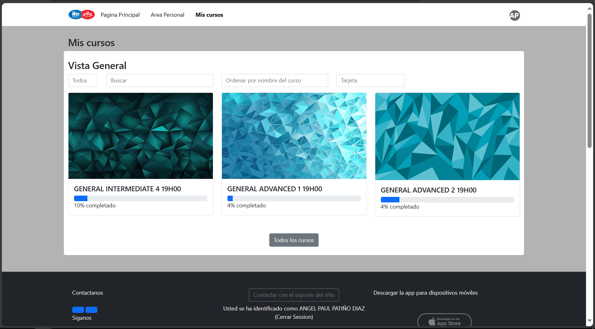
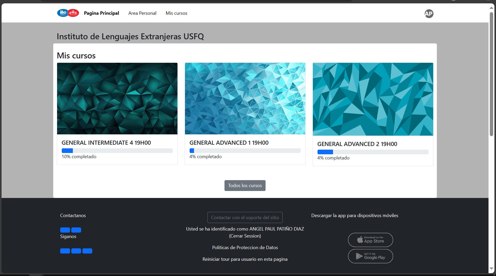

# Uso de Componentes en el Proyecto - Réplica de Moodle

Este proyecto consiste en la implementación de diversos componentes web que juntos forman una réplica de la interfaz de Moodle. Cada componente tiene su propio propósito y funcionalidad específicos. A continuación, se describen los componentes principales y cómo integrarlos en tu proyecto.

## Componentes del Proyecto

### 1. `pagina-principal`

El componente `pagina-principal` proporciona una estructura básica para la página principal del sitio. Incluye una barra de navegación, secciones de cursos y un pie de página informativo.

**Uso:**
```html
<pagina-principal></pagina-principal>
```

### 2. `area-personal`

El componente `area-personal` está destinado a la sección de área personal del usuario. Incluye funcionalidades como notificaciones y mensajes.

**Uso:**
```html
<area-personal></area-personal>
```

### 3. `mi-campus-login`

El componente `mi-campus-login` proporciona un formulario de inicio de sesión personalizado con opciones de idioma, enlaces de recuperación de contraseña y configuración de cookies.

**Uso:**
```html
<mi-campus-login usernamePlaceholder="..." passwordPlaceholder="..." submitButtonText="..."
    forgotPasswordLink="..." forgotPasswordText="..." languageOptionValue="..."
    languageOptionText="..." cookiesLink="..." cookiesText="..."></mi-campus-login>
```

### 4. `mis-cursos`

El componente `mis-cursos` presenta una interfaz de navegación para acceder a los cursos disponibles. Incluye tarjetas de curso con información y progreso.

**Uso:**
```html
<mis-cursos></mis-cursos>
```

## Integración en tu Proyecto

1. Clona este repositorio en tu máquina local:

    ```bash
    git clone https://github.com/Anyel-ec/HTML-BS5-Web-Components-ReplicationMoodle
    ```

2. En tu archivo HTML principal, vincula los archivos JavaScript de cada componente que necesites:

    ```html
    <script src="ruta/a/area-personal.js"></script>
    <script src="ruta/a/inicio.js"></script>
    <script src="ruta/a/mi-campus-login.js"></script>
    <script src="ruta/a/mis-cursos.js"></script>
    ```

3. Integra los componentes necesarios en tu HTML:

    ```html
    <!DOCTYPE html>
    <html lang="en">

    <head>
        <meta charset="UTF-8">
        <title>Réplica de Moodle</title>
        <link rel="stylesheet" href="https://cdnjs.cloudflare.com/ajax/libs/font-awesome/6.0.0-beta2/css/all.min.css">
        <!-- CDN bs5 -->
        <link rel="stylesheet" href="https://cdnjs.cloudflare.com/ajax/libs/bootstrap/5.1.0/css/bootstrap.min.css">
    </head>

    <body>
        <pagina-principal></pagina-principal>
        <area-personal></area-personal>
        <mi-campus-login></mi-campus-login>
        <mis-cursos></mis-cursos>

        <script src="ruta/a/inicio.js"></script>
        <script src="ruta/a/area-personal.js"></script>
        <script src="ruta/a/mi-campus-login.js"></script>
        <script src="ruta/a/mis-cursos.js"></script>
    </body>

    </html>
    ```

4. ¡Personaliza y disfruta de tu réplica de Moodle!

## Cambio de Idioma

Para cambiar el idioma de la página, puedes seguir uno de estos enlaces:
- [Readme en Inglés](./README.md)
- [Readme en Español](./README-es.md)

## Capturas de Pantalla

### Login 
 
### Area Personal 
 
### Mis Cursos 
 
### Pagina Personal 
 


¡Explora y disfruta de la experiencia del proyecto Moodle Replica!