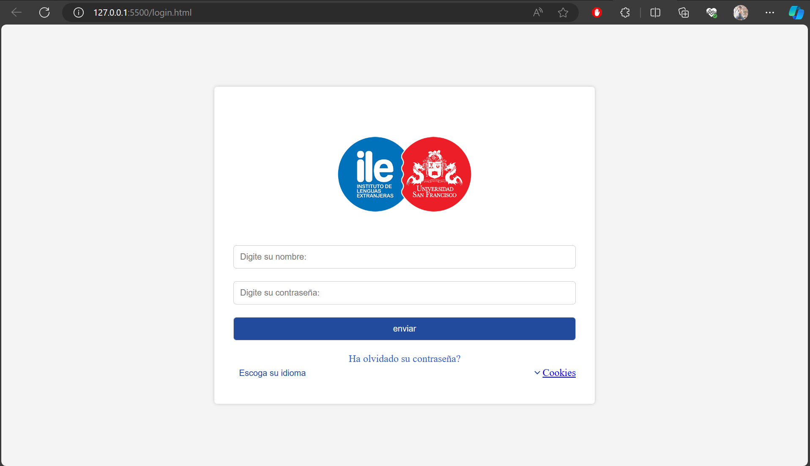
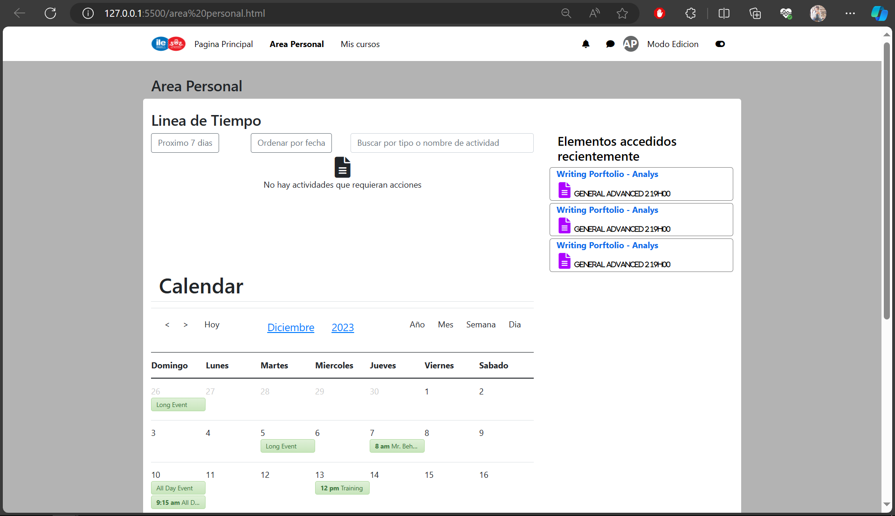

# Usage of Components in the Project - Moodle Replica

This project involves the implementation of various web components that together form a replica of the Moodle interface. Each component has its own specific purpose and functionality. Below, the main components are described along with how to integrate them into your project.

## Project Components

### 1. `pagina-principal`

The `pagina-principal` component provides a basic structure for the site's main page. It includes a navigation bar, course sections, and an informative footer.

**Usage:**
```html
<pagina-principal></pagina-principal>
```

### 2. `area-personal`

The `area-personal` component is intended for the user's personal area section. It includes functionalities such as notifications and messages.

**Usage:**
```html
<area-personal></area-personal>
```

### 3. `mi-campus-login`

The `mi-campus-login` component provides a customized login form with language options, password recovery links, and cookie settings.

**Usage:**
```html
<mi-campus-login usernamePlaceholder="..." passwordPlaceholder="..." submitButtonText="..."
    forgotPasswordLink="..." forgotPasswordText="..." languageOptionValue="..."
    languageOptionText="..." cookiesLink="..." cookiesText="..."></mi-campus-login>
```

### 4. `mis-cursos`

The `mis-cursos` component presents a navigation interface to access available courses. It includes course cards with information and progress.

**Usage:**
```html
<mis-cursos></mis-cursos>
```

## Integration into Your Project

1. Clone this repository to your local machine:

    ```bash
    git clone https://github.com/Anyel-ec/HTML-BS5-Web-Components-ReplicationMoodle
    ```

2. In your main HTML file, link the JavaScript files of each component you need:

    ```html
    <script src="path/to/area-personal.js"></script>
    <script src="path/to/inicio.js"></script>
    <script src="path/to/mi-campus-login.js"></script>
    <script src="path/to/mis-cursos.js"></script>
    ```

3. Integrate the necessary components into your HTML:

    ```html
    <!DOCTYPE html>
    <html lang="en">

    <head>
        <meta charset="UTF-8">
        <title>Moodle Replica</title>
        <link rel="stylesheet" href="https://cdnjs.cloudflare.com/ajax/libs/font-awesome/6.0.0-beta2/css/all.min.css">
        <!-- CDN bs5 -->
        <link rel="stylesheet" href="https://cdnjs.cloudflare.com/ajax/libs/bootstrap/5.1.0/css/bootstrap.min.css">
    </head>

    <body>
        <pagina-principal></pagina-principal>
        <area-personal></area-personal>
        <mi-campus-login></mi-campus-login>
        <mis-cursos></mis-cursos>

        <script src="path/to/inicio.js"></script>
        <script src="path/to/area-personal.js"></script>
        <script src="path/to/mi-campus-login.js"></script>
        <script src="path/to/mis-cursos.js"></script>
    </body>

    </html>
    ```

4. Customize and enjoy your Moodle Replica!

## Language Change

To change the language of the page, you can follow one of these links:
- [Readme in English](./README.md)
- [Readme in Spanish](./README-es.md)

## Screenshots

### Login 
 
### Personal Area 
 
### My Courses 
 
### Main Page 
 

Explore and enjoy the Moodle Replica project experience!


## Link Social
[](https://anyel.top/)
[](https://www.linkedin.com)
[](https://www.tiktok.com/@anyel.ec)
[](https://api.whatsapp.com/send?phone=593991675490&text=Un%20gusto%20en%20saludarte💻🌟)
[](https://www.youtube.com/channel/UC7In8IjfwKn-PUMYaC0NtUg)
[](https://www.facebook.com/ecanyel/)

